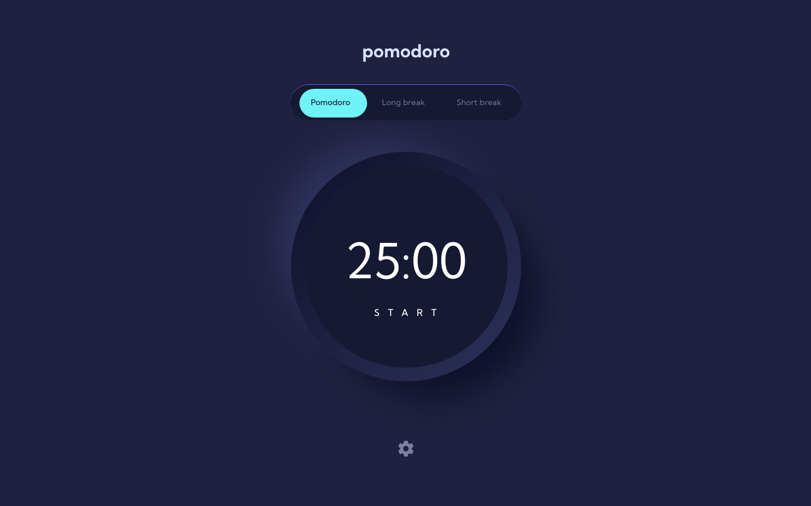

# Frontend Mentor - Pomodoro app solution

This is a solution to the [Pomodoro app challenge on Frontend Mentor](https://www.frontendmentor.io/challenges/pomodoro-app-KBFnycJ6G). Frontend Mentor challenges help you improve your coding skills by building realistic projects.

## Table of contents

- [Overview](#overview)
  - [The challenge](#the-challenge)
  - [Screenshot](#screenshot)
  - [Links](#links)
- [My process](#my-process)
  - [Built with](#built-with)
  - [What I learned](#what-i-learned)
  - [Continued development](#continued-development)
  - [Useful resources](#useful-resources)
- [Author](#author)
- [Acknowledgments](#acknowledgments)

## Overview

### The challenge

Users should be able to:

- Set a pomodoro timer and short & long break timers
- Customize how long each timer runs for
- See a circular progress bar that updates every minute and represents how far through their timer they are
- Customize the appearance of the app with the ability to set preferences for colors and fonts

### Screenshot



### Links

- Solution URL: [Add solution URL here](https://github.com/ttsoares/pomodoro)
- Live Site URL: [Add live site URL here](https://pomodoro-beta-rust.vercel.app/)

## My process

### Built with

- First build functionalities
- Second static styling
- Then dinamic styling
- Finally responsivity
- Desktop-first workflow
- [React](https://reactjs.org/) - JS library
- [TailwindCSS](https://tailwindcss.com/) - For styles
- [Zustand](https://www.npmjs.com/package/zustand) - A small, fast and scalable bearbones state-management solution using simplified flux principles.
- [Circular Progressbar](https://www.npmjs.com/package/react-circular-progressbar) - A circular progressbar component, built with SVG

### What I learned

How to use the library React Circular ProgressBar.
On purpose, I did not use the 'react-countdown-circle-timer' because that would be too easy...

```tsx
<CircularProgressbar
  value={progress}
  text={formatTime(timer.remainingTime)}
  styles={buildStyles({
    textColor: "#ffffff",
    pathColor: color,
    trailColor: "#161932",
    textSize: `${clockFontSize}px`,
  })}
  strokeWidth={5}
/>
```

### Continued development

I'm in a quest to find other developers or groups to be able to design and build any kind of system: Front and Back-end.

### Useful resources

- [Progress Bar demos](https://codesandbox.io/p/sandbox/vymm4oln6y?file=%2Findex.js) - Several examples of React progress bar.
- [Example resource 2](https://www.example.com) - This is an amazing article which helped me finally understand XYZ. I'd recommend it to anyone still learning this concept.

## Author

- Website - [Thomas TS](https://buildesign.vercel.app/)
- Frontend Mentor - [@ttsoares](https://www.frontendmentor.io/profile/ttsoares)
- Linkedin - [thomas-soares-6791781b/](https://www.linkedin.com/in/thomas-soares-6791781b/)

## Acknowledgments

Mentorship of different AIs like ChatGPT, DeepSeek and Windsurf.
